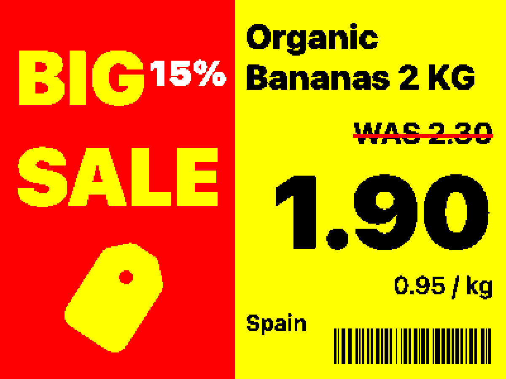

# PicPak Studio

A small macOS poster editor for 4-colour e-paper PicPak panels — black, white, red, yellow, 400 × 300.
Think MS Paint, but every pixel it produces is already legal on the panel.

Built with SwiftUI, no dependencies, and no Xcode required to build it.



## Install

Grab `PicPak-Studio.zip` from the [latest release](../../releases/latest), unzip it, and drag
**PicPak Studio.app** to `/Applications`.

The app is ad-hoc signed rather than notarised, so the first launch needs one extra step: **right-click
the app and choose Open**, then confirm. Double-clicking it the normal way will just say it "cannot be
opened", which is Gatekeeper's standard message for anything without a paid developer certificate — not
a sign anything is wrong. macOS remembers the choice after the first time.

Requires macOS 14 or later, on Apple silicon.

## Build it yourself

No Xcode needed — the Command Line Tools toolchain is enough.

```bash
./build.sh
```

That produces `build/PicPak Studio.app`. Double-click it, or `open "build/PicPak Studio.app"`.

```bash
./check.sh
```

runs the headless checks: every template renders, the exported PNG's stored bytes are verified to
contain only the four inks, projects round-trip through both file formats, and the snapping,
layer-ordering and zoom maths are all exercised.

## What it does

**Elements** — rectangle, ellipse, triangle, star, line, text, SF Symbol, SVG, bitmap image, barcode
(Code 128 and QR). Every one of them paints in the four panel inks and nothing else.

**Layers** — a live-thumbnail list, front-to-back. Drag rows to restack them (a grip appears on
hover; drag a multi-selection and the group keeps its own internal order), double-click to rename,
and toggle hide and lock per layer.

**Text** — any installed font family, six weights, auto-fit (shrinks type until it fits its box),
tracking, line spacing, strikethrough in a second colour, and inline editing on the canvas
(double-click, or Return with a text layer selected).

**SF Symbols** — all ~7,900 symbols the running system knows about, searchable, recoloured to any ink.

**SVG** — imported as vector artwork. Recolour it to a flat silhouette in one ink, or keep its own
colours and let them reduce to the gamut.

**Bitmaps** — brightness and contrast, a white-background knockout for product shots, and three
reduction modes: flat nearest-colour, Floyd–Steinberg diffusion, or an ordered halftone.

**Canvas** — pixel rulers down the top and left edge, with the selection's extent shaded so you can
read off exactly how far a shape reaches. Magnetic snapping to panel edges, centres and other
elements, when moving *and* when resizing: drag a rectangle's right edge toward the middle of the
panel and it lands on 200 exactly. Plus a grid, a bezel margin, arrow-key nudging, marquee
selection, rotation, align and distribute.

**Gamut check** — how much of the panel each ink covers, so you can see at a glance whether a design
is mostly red before you print it.

**Panel preview** — toggles the canvas to the reduced bitmap the panel will actually paint.

## Files

**`.picpak`** — the editable project. Plain JSON, and self-contained: imported SVGs and photos are
embedded, so a single file is the whole thing. Send one to a colleague and they get your layers.

**PNG** — exported at exactly 400 × 300, every pixel byte-exactly one of the four inks. `@2x` and
`@4x` are integer nearest-neighbour blow-ups, so a large PNG still shows the panel's real pixels.

Exported PNGs are **non-destructive**: the project is compressed into a private `tEXt` chunk inside
the file. Open that PNG back in PicPak Studio and every layer is still editable. Other software
sees an ordinary PNG.

## Push to display

`File ▸ Push to Panel…` (⌘P) sends the poster to a panel through Tesserae.

It creates one Tesserae page per document (remembered in the project, so re-pushing updates the same
page instead of piling up), sets a full-bleed code element holding the PNG as a data URI, binds the
chosen panels, and pushes. Only the panels this document was last sent to are pre-selected — never
every panel on the network.

Set the server address and MCP token once in **PicPak Studio ▸ Settings… (⌘,)**, under *Panels*.
There's a *Test Connection* button there, and the Push sheet links back to it.

Both are stored in plain text in `~/Library/Preferences/com.picpak.studio.plist`, and the Settings
window says so next to the field. The token was in the Keychain originally, which sounds better but
behaved worse: the app is ad-hoc signed, so its signature changes on every build, the item's access
control stops matching, and macOS asks for your login password again — twice per push. There is now
no Keychain call anywhere in the app, which is the only way to be sure it can never prompt. This is
a token for a server on your own LAN; the trade is deliberate.

Because the image is already reduced to the panel's exact gamut at its exact size, the server's own
fit-and-quantise step is a no-op — what you see in the editor is what lands on the panel.

## Keyboard

| | |
|---|---|
| ⌘N / ⇧⌘N | New from template / new blank |
| ⌘O · ⌘S · ⇧⌘S | Open · Save · Save As |
| File ▸ Open Recent | Recently opened projects, shared with the Dock menu |
| ⌘E · ⇧⌘C | Export PNG · copy panel image |
| ⌘I | Place artwork |
| ⌘P | Push to panel |
| ⌘Z · ⇧⌘Z | Undo · redo |
| ⌘D | Duplicate |
| ⌘[ · ⌘] | Send backward · bring forward |
| ⇧⌘[ · ⇧⌘] | Send to back · bring to front |
| ⇧⌘R · ⌘' · ⌘Y | Rulers · grid · panel preview |
| ⌘+ · ⌘- · ⌘0 | Zoom in · out · actual size |
| Arrows · ⇧Arrows | Nudge 1px · 10px |
| Pinch · wheel · ⌘-scroll | Zoom the artboard, anchored under the pointer |
| Return | Edit the selected text layer |
| Delete · Escape | Delete selection · deselect |

While dragging: **⇧** constrains to an axis or keeps aspect, **⌥** resizes from the centre,
**⌘** suspends snapping.

### Zooming

Pinch on a trackpad, or roll a mouse wheel, and the artboard zooms around whatever is under the
pointer. A trackpad's plain two-finger scroll keeps *panning* — it only zooms with ⌘ held — because
otherwise there'd be no way left to pan. A notched mouse wheel has nothing else to do, so it zooms
on its own. The two are told apart by `NSEvent.hasPreciseScrollingDeltas`, which is false only for a
real wheel.

## Layout

```
Sources/PicPakStudio/
  Model/      palette, element, document, store (undo/selection), geometry + snapping, templates
  Render/     image reduction and dithering, fonts and auto-fit, the shared poster view, PNG export
  UI/         canvas editor, layers, inspector, symbol picker, controls, file actions
  Tesserae/   REST client and the push sheet
```

`PosterView` is the single renderer. The editor draws it at the current zoom and the exporter draws
the very same view at scale 1 — there is no second drawing path that could drift.

### Keeping the canvas at full frame rate

A drag used to write to the store on every mouse move, which re-rendered the layers panel and the
inspector alongside the canvas. Six things were measured and moved off the per-frame path:

- **A live drag never touches the store.** The moving elements are held in the canvas' own state and
  folded into the document once, on mouse-up, as a single undo step. Nothing outside the canvas
  re-renders while you drag.
- **`PicPakDocument` compares assets by id, not by content.** The synthesised `==` walked every
  embedded photo's bytes, and SwiftUI paid for that on every view diff.
- **The board's drop shadow sits on its own static rectangle.** Attached to the canvas it forced an
  offscreen re-blur of the whole board every frame; now only a zoom change invalidates it.
- **`NSFontManager.availableFontFamilies` cost 14 ms per call** and ran on every inspector pass while
  a text layer was selected. Resolved once now, and the family chooser is a popover rather than a
  181-item `Picker` rebuilt on every keystroke.
- **Reducing the panel to 4 colours costs ~11 ms.** Panel preview and the gamut meter trail the
  document revision with a short debounce instead of recomputing inline.
- **Element views take one element**, not the whole document, and are wrapped in `.equatable()` so
  untouched layers are skipped.

If it ever feels slow again, get numbers rather than guesses:

```bash
PICPAK_PERF=1 "build/PicPak Studio.app/Contents/MacOS/PicPak Studio"
```

Each active second prints `perf 1.0s  canvas 61  element 63  inspector 0  layers 0`. During a drag
only `canvas` and `element` should move — if `inspector` or `layers` climb, a drag is leaking back
into the observed store.
